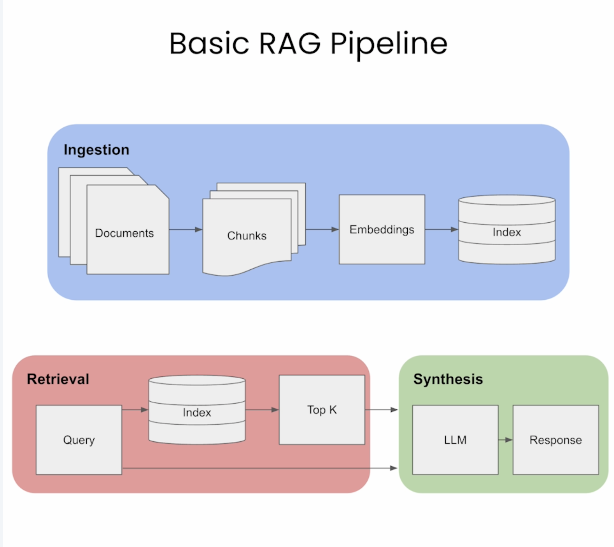
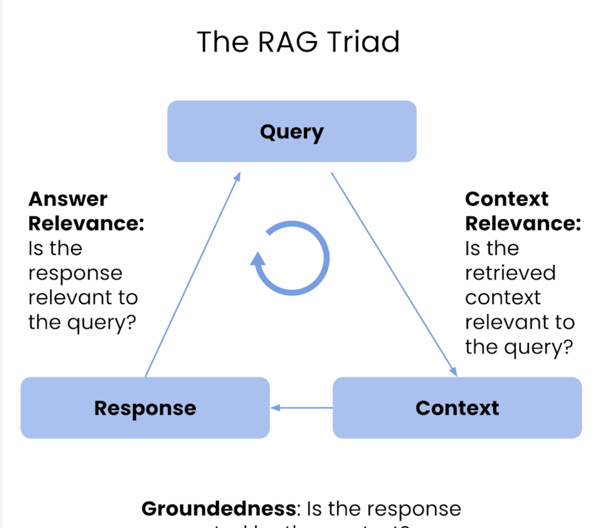

# Retrieval Strategies in RAG

## 1. Standard Chunk Retrieval

```text
Document → fixed-size chunks → retrieve chunks
````

### Example

Retrieve:

```text
500-token chunk
```

### Pros

* Simple
* Fast
* Good overall context

### Cons

* Noisy retrieval
* Irrelevant text included
* Higher token cost

### Best for

* Simple RAG systems
* Small projects
* Basic PDFs/docs

---

## 2. Sentence Window Retrieval

```text
Retrieve relevant sentence
+
add nearby sentence window
```

### Example

Retrieve:

```text
Target sentence
+ previous sentence
+ next sentence
```

### Pros

* High retrieval precision
* Lower token usage
* More focused retrieval

### Cons

* Can lose broader context
* Weak grounding sometimes
* Fragmented information risk

### Best for

* Research papers
* Educational content
* Precise QA systems

---

## 3. Auto-Merging Retrieval

```text
Retrieve small chunks
+
merge related parent context automatically
```

### Example

Retrieve:

```text
Small relevant chunks
→ merged into larger coherent section
```

### Pros

* Precision + context together
* Better groundedness
* Smarter retrieval
* More production-grade

### Cons

* More complex
* Slightly slower
* More engineering overhead

### Best for

* Production RAG systems
* Large document bases
* Complex QA pipelines

---

# One-line Intuition

| Technique         | Main Idea                      |
| ----------------- | ------------------------------ |
| Standard Chunking | Retrieve large blocks          |
| Sentence Window   | Retrieve precise sentences     |
| Auto-Merging      | Retrieve small → merge smartly |

---

# Easy Memory Trick

```text
Chunking       = brute-force context
SentenceWindow = precision retrieval
AutoMerging    = precision + reconstructed context
```



